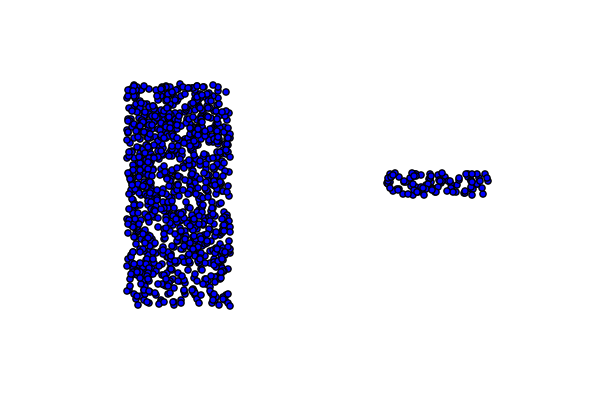
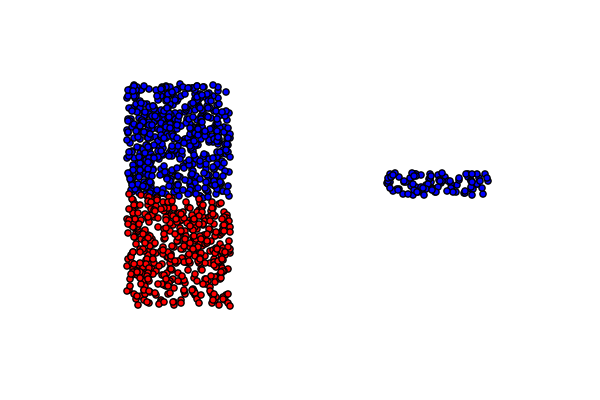

=========
Clusteror
=========

* Unveils internal "invisible" patterns automatically
* https://github.com/enfeizhan/clusteror
* Fei Zhan
* License: MIT License

Description
===========

This is a tool for discovering patterns existing in a dataset. It can be useful
in segmenting customers based on their demographic, geographic, and past
behaviours in a commercial marketing environment. Users are encouraged to
adventure with it in other scenarios.

Under the hood, a pretraining of 
`(Stacked) Denoising Autoencoder <https://en.wikipedia.org/wiki/Autoencoder>`__
is implemented in
`Python deep learning <http://deeplearning.net/tutorial/>`__ library
`Theano <http://deeplearning.net/software/theano/>`__. Therefore, an installation
of Theano is mandate. About how to install Theano, please read
`Theano installation guide <http://deeplearning.net/software/theano/install.html>`__.

If you are lucky to have Nvidia graphic card, with proper setup Theano can
parallel the calculation to be able to scale up to large datasets.

Why we need it
==============

The purpose of Unsupervised Machine Learning is to find underlying patterns
without being provided with known categories as Supervised Classification
Machine Learning. While it sounds like the most leveraged use case of Machine
Learning as it does not rely on expensive labels that generally need to be
created by human, its efficiency is debatable for commonly seen algorithms.

Recall the very first clustering algorithm in machine learning lectures,
K-Means. It looks amazing for beginners. The randomly initiated centroids
seem to be intelligent to know where they should gravitate to. At least for
the example datasets for illustrating purposes.

But real life problems aren't that straightforward. It's not unlikely you are
given a dataset that looks like this in a 2D space:

Then you really scratch your head to see this is really the best K-Means can
do:

The cost function of K-Means instructs centroids to search for points
located in a spharical region centring around them. This assumption of what
a cluster is no doubt fails when a cluster of points resides in a stripe
shape like in the example above.

Note
====

This project has been set up using PyScaffold 2.5.7. For details and usage
information on PyScaffold see http://pyscaffold.readthedocs.org/.
