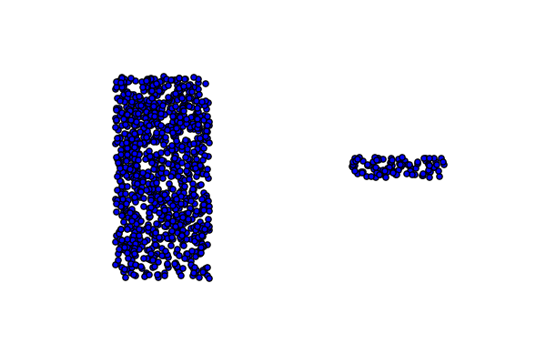
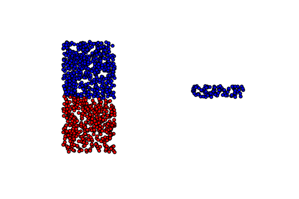
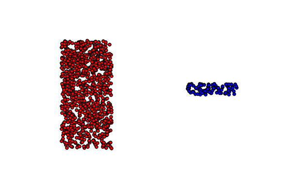
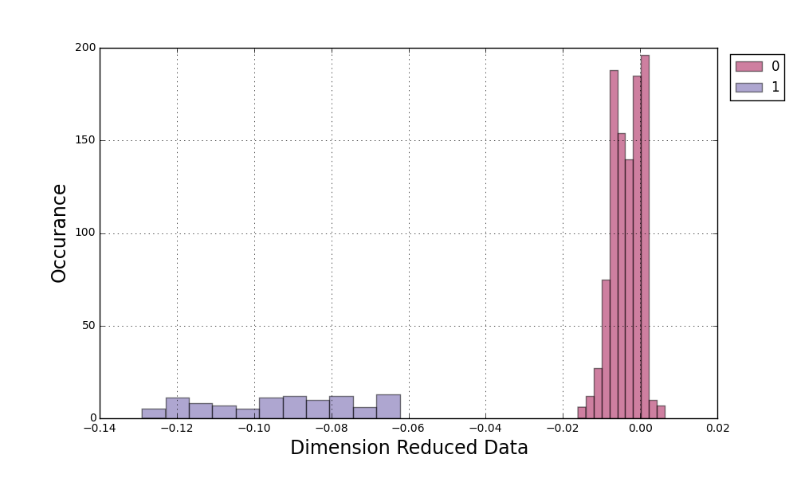

=========
Clusteror
=========

* Unveils internal "invisible" patterns automatically
* https://github.com/enfeizhan/clusteror
* Fei Zhan
* License: MIT License

Version support
===============
This package is developed in Python 3.4. However support for Python 2 will be
in the next release.

Description
===========

This is a tool for discovering patterns existing in a dataset. It can be useful
in segmenting customers based on their demographic, geographic, and past
behaviours in a commercial marketing environment. Users are encouraged to
adventure with it in other scenarios.

Under the hood, a pretraining of 
`(Stacked) Denoising Autoencoder <https://en.wikipedia.org/wiki/Autoencoder>`__
is implemented in
`Python deep learning <http://deeplearning.net/tutorial/>`__ library
`Theano <http://deeplearning.net/software/theano/>`__. Therefore, an installation
of Theano is mandate. About how to install Theano, please read
`Theano installation guide <http://deeplearning.net/software/theano/install.html>`__.

If you are lucky to have Nvidia graphic card, with proper setup Theano can
parallel the calculation to be able to scale up to large datasets.

Why we need it?
===============

The purpose of Unsupervised Machine Learning is to find underlying patterns
without being provided with known categories as Supervised Classification
Machine Learning. While it sounds like the most leveraged use case of Machine
Learning as it does not rely on expensive labels that generally need to be
created by human, its efficiency is debatable for commonly seen algorithms.

Recall the very first clustering algorithm in machine learning lectures,
K-Means. It looks amazing for beginners. The randomly initiated centroids
seem to be intelligent to know where they should gravitate to. At least for
the example datasets for illustrating purposes.

But real life problems aren't that straightforward. It's not unlikely you are
given a dataset that looks like this in a 2D space:

Unfortunately this is the best K-Means can do and you probably scratch you head
wondering what you can do to solve this seemingly straightforward problem.

The cost function of K-Means instructs centroids to search for points
located in a spharical region centring around them. This assumption of what
a cluster is no doubt fails when a cluster of points resides in a stripe
shape like in the example above.

How can we do better?
=====================
This "unexpected" (actually this is a well-known fact) failure stems from that
K-Means fumbles in higher dimensional space. While this terminates K-Means to
be an awesome clustering tool that is deployable in extensive environments,
its performance in one dimensional space has been ignored largely due to
examples in two dimension are more illustrative.

Having this in mind, we would work on to search ways of reducing high
dimensional dataset to one dimension. As this is truly the cause responsible
for all strugglings in clustering high dimensional data.

Fortunately, the progress in Deep Learning sheds new light on this issue. As
labeled dataset is expensive, experts in this area came up with the salient
idea of Pre-training, which enormously reduced the amount of labeled dataset
needed to train a deep learning neural network.

In a nutshell, pre-training updates the parameters in neural network such that
an input can traverse the network forward and back therefore reproduce itself.
A cost function is defined regarding the difference between the input and
reproduced input instead of input and output.

While it's highly recommended to read research articles to gain more detail,
a characteristic property of this process is tremendously useful for reducing
dataset in high dimension down to lower dimension.

The central idea is given the input can be loyally or nearly loyally
reproduced the neural network can be expected to do two things:

* one-to-one mapping input to output; A different input results in a different
  output.
* Similar inputs lead to close outputs.

These two characteristics ensure clustering done in low-dimensional space
is equivalent to do the clustering in high dimension.

A picture is worth a thousand words. The chart below is the result of a three
layer neural network:

The magic lies in how it looks in the mapped one dimensional space:

Without too much explanation, the left blue bars are the from the right blue
points and the right red bars from the left red points. As there isn't
concept for a sphere in 1d, K-Means works perfectly.

What's in the package and what's coming up?
===========================================
At the moment, you can do the following with the tools provided by the
package:

* Dimension reduction to 1d.
* Clustering in 1d and assign cluster ids back to the original dataset.
* Certain useful plotting tools to display the efficiency of the clustering.

This project is still in alpha stage. In the imminent release, you can expect

* Tools to searching for the drivers that distinct the clusters.
* More support in Python versions.

Note
====

This project has been set up using PyScaffold 2.5.7. For details and usage
information on PyScaffold see http://pyscaffold.readthedocs.org/.
